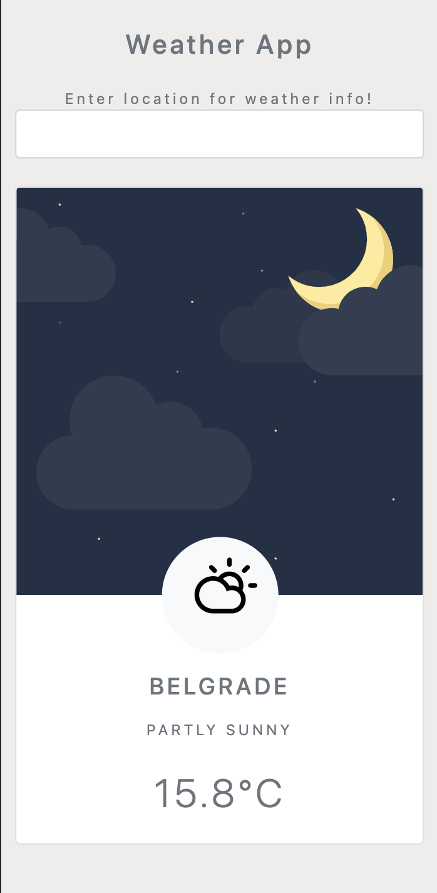

# Another Weather App

> This simple Weather app demonstrates how to use JavaScript to handle asynchronous functions by integrating third-party service, such as AccuWeather weather APIs.

The project was build using vanilla JavaScript by applying the JS approach of Promises.

## Built With

- JavaScript
- Webpack bundler
- AccuWeather API service for location weather forecast

## Live Demo

[Live Demo Link](https://marijanbrvar.github.io/Weather-App/)

## Getting Started

**Click at the above link "Live demo." After the application opens, please type the city's name in the current weather situation, e.g., Belgrade. Depending on the time zone of the selected city application, it will render different visuals to show whether it is day or night time. Right below the primary visual, there is also an icon representing current weather and a textual description.**

To get a local copy up and running, follow these simple example steps.

### Prerequisites
Locally installed Node and NPM
To acquire an API key from AccuWeather, you must register a developer account and create a new application. Under the newly registered app, you can find An API key.
Create ".env" file in the root directory and enter the new key
`API_KEY=[api key from AccuWeather app].`

### Setup
`git clone git@github.com:marijanbrvar/Weather-App.git && cd Weather-App.`
Run `npm install` to download dependencies.
Execute shell command `npm run start` to run the application locally on your computer.
### Usage
Wen application is opened in your web browser, TYpe city name in the input field, and the result will show below the input field.

## Authors

👤 MARIJAN BRVAR

- GitHub: [@githubhandle](https://github.com/marijanbrvar)
- Twitter: [@twitterhandle](https://twitter.com/marijanbrvar)
- LinkedIn: [LinkedIn](https://linkedin.com/in/marijanbrvar)

## 🤝 Contributing

Contributions, issues, and feature requests are welcome!

Feel free to check the [issues page](https://github.com/marijanbrvar/Weather-App/issues).

## Show your support

Give a ⭐️ if you like this project!

## Acknowledgments

- Icons and visual are acquired from Adam Whitcroft at (https://thenounproject.com/adamwhitcroft/collection/climacons/)

## 📝 License

This project is [MIT](https://github.com/marijanbrvar/Weather-App/blob/Feature/LICENSE) licensed.
